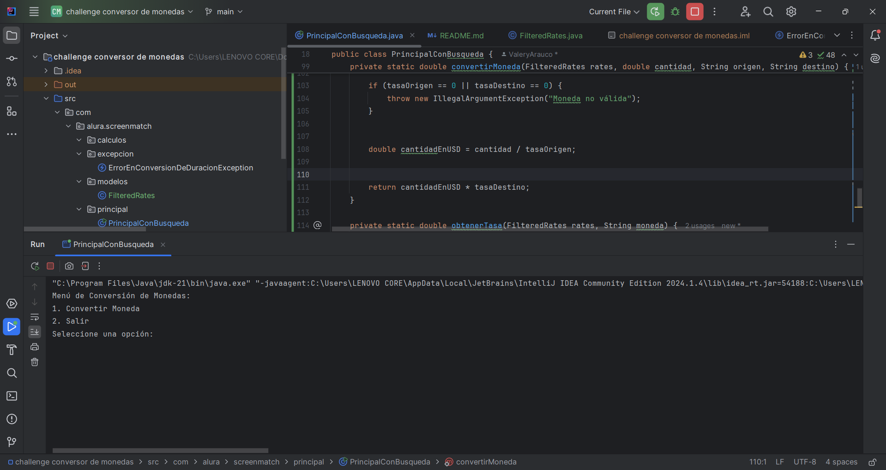

# Proyecto de Conversor de Monedas 



## Índice
- [Descripción del Proyecto](#descripción-del-proyecto)
- [Estado del Proyecto](#estado-del-proyecto)
- [Demostración de Funciones y Aplicaciones](#demostración-de-funciones-y-aplicaciones)
- [Acceso al Proyecto](#acceso-al-proyecto)
- [Tecnologías Utilizadas](#tecnologías-utilizadas)
- [Personas Desarrolladoras del Proyecto](#personas-desarrolladoras-del-proyecto)


## Descripción del Proyecto
Este proyecto es un conversor de monedas interactivo que permite a los usuarios convertir entre varias monedas utilizando tasas de cambio obtenidas de la API de Exchange Rate. Los usuarios pueden ingresar cantidades, seleccionar monedas de origen y destino, y ver el resultado de la conversión en tiempo real a través de una interfaz de consola.

## Estado del Proyecto
El proyecto se encuentra en estado de desarrollo inicial. Se ha implementado la funcionalidad básica de conversión de monedas y la interacción con el usuario a través de una interfaz de consola.

## Demostración de Funciones y Aplicaciones
1. **Conversión de Moneda:**
   - El usuario ingresa la cantidad a convertir.
   - Selecciona la moneda de origen.
   - Selecciona la moneda de destino.
   - El programa muestra el resultado de la conversión.

2. **Menú Interactivo:**
   - El usuario puede seleccionar opciones del menú para convertir moneda o salir del programa.

## Acceso al Proyecto
Para acceder al proyecto, clona el repositorio desde GitHub:
```bash
git clone https://github.com/ValeryArauco/Conversor-de-monedas.git
```
Luego, compila y ejecuta el proyecto en tu entorno de desarrollo Java.

## Tecnologías Utilizadas
- **Java:** Lenguaje de programación principal del proyecto.
- **Gson:** Biblioteca para el manejo de JSON.
- **API de Exchange Rate:** Fuente de las tasas de cambio utilizadas en las conversiones.

## Personas Desarrolladoras del Proyecto
- Valery Arauco (https://github.com/ValeryArauco)
